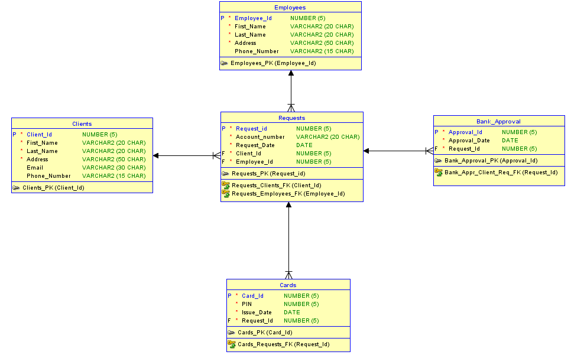

# Payment card issuing process 

This is an oversimplified application of a payment card issuing process that serves more as Spring-JPA example with some of its 
features used. Application might be updated in the future with some additional features.

## Database schema overview: 

Client files a request for payment card, request gets processed by a bank that gives its approval and the bank issues a card to client.

## Installation: 

### 1 - clone the project 
        git clone https://github.com/jocavad/cards.git

### 2 - prepare the database 
        src/main/resources/db.sql
        Since oracle was used as a database, sequences were used as an identifier generator.

### 3 - build project 
    if using oracle then download ojdbc6.jar from oracle.com, and add it manually:
        mvn install:install-file -Dfile="<path_to_jar>\ojdbc6.jar" -DgroupId=com.oracle -DartifactId=ojdbc6 -Dversion=11.2.0.3.0 -Dpackaging=jar
        mvn clean package
    change properties in src/main/resources/db/jdbc.properties file

### 4 - deploy 
	glassfish
            remove context.xml from webapp/META-INF folder, if there is any, 
            and add <class-loader delegate="false"/> in glassfish-web.xml
                deploy --contextroot Cards "<path_to_package>/Cards-1.0-SNAPSHOT.war"
	tomcat
            copy war file to webapps folder and restart the server

### 5 - run the application in your browser 
        localhost:<server_port_number>/Cards
